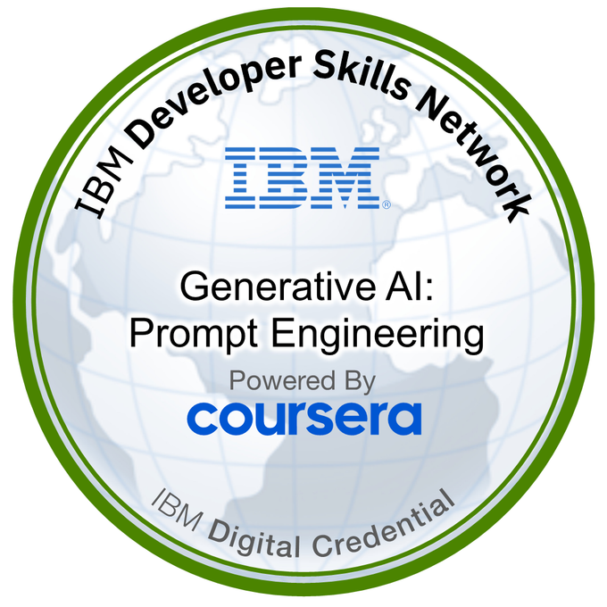
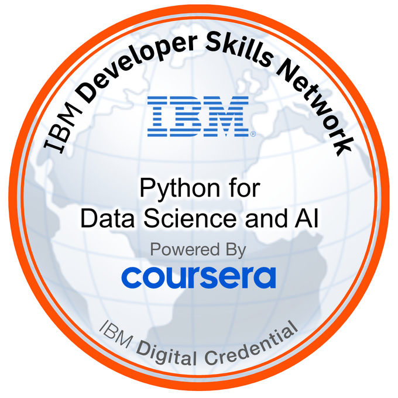
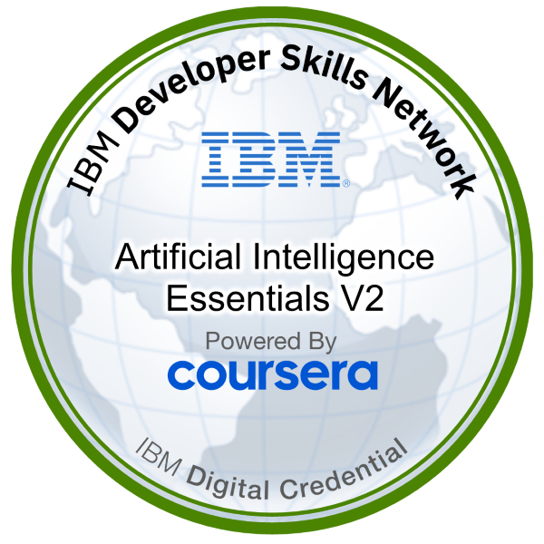
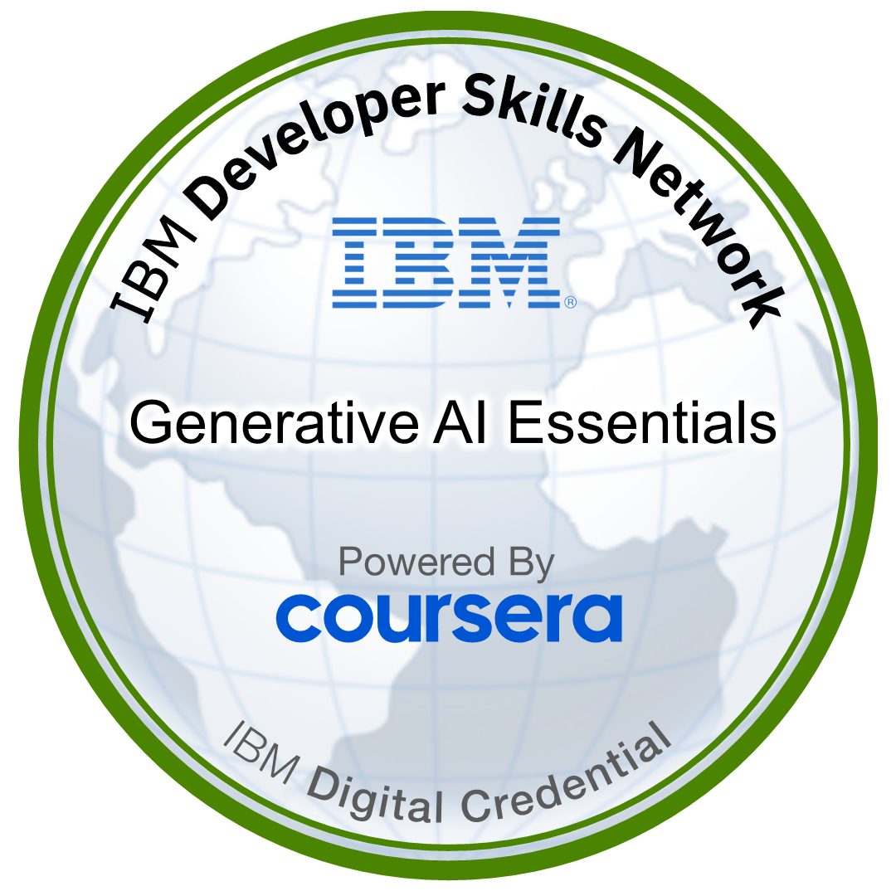
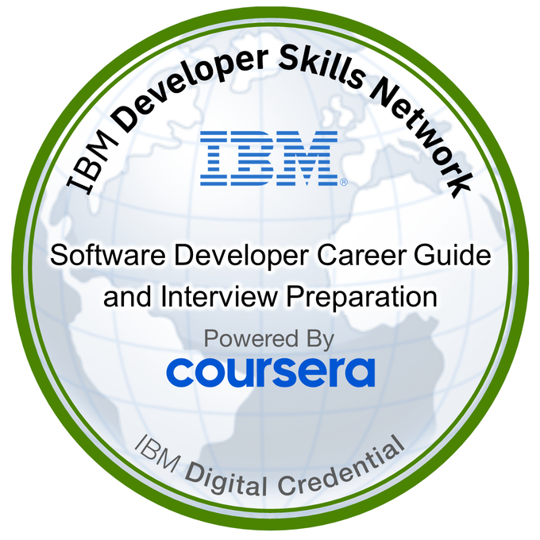

<h1 align="center"><b>Hi 👋, I'm Aqib Javed</b></h1>
<h3 align="center">🚀  AI &amp; Machine Learning Enthusiast | Deep Learning | Computer Vision | Generative AI 
</h3>

---

## 🏆 Achievements  
<h1 align="center">
  
    🧠 IBM AI Developer
  
</h1>

  <!-- Replace each link below with your individual Credly badge URLs -->
  
  
  
  
  
  
  
  

---

### 🌱 About Me
- 💡 Passionate about **Artificial Intelligence,Machine Learning, Deep Learning, Generative AI and Agentic AI**
- 🧠 IBM Certified **AI Developer Professional**
- 💬 Ask me about **Python, MySQL, Pandas, NumPy, Scikit-learn, TensorFlow, Keras, FastAPI, Pydantic**
- 🔭 Currently working on **Generative AI & Model Deployment**
- 📫 Reach me at: **aqibjaved5777@gmail.com**

---

### 🧰 Languages & Tools

  
  
  
  
  
  
  
  

---

---

### 🌐 Connect with Me

  

